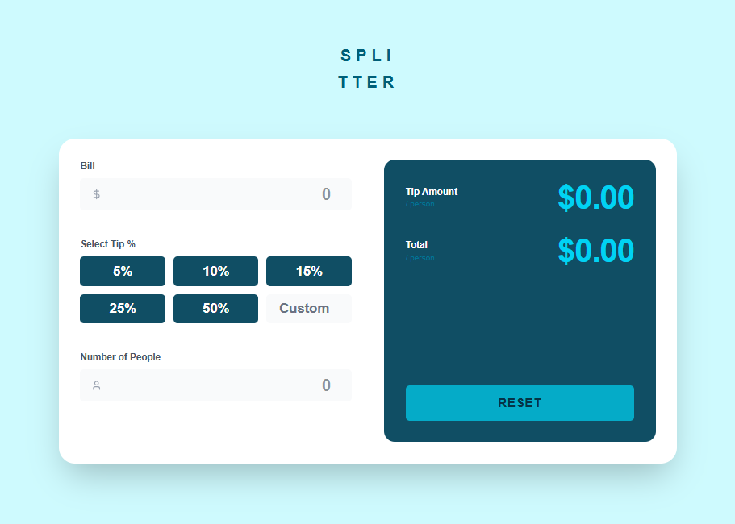

# 🧮 Tip Calculator - Splitter

A beautiful and intuitive tip calculator built with Next.js 14, TypeScript, and Tailwind CSS. Split bills and calculate tips easily with a clean, modern interface.



## ✨ Features

- 💰 Calculate tip amount per person
- 🧾 Calculate total amount per person
- 🎯 Preset tip percentages (5%, 10%, 15%, 25%, 50%)
- ✏️ Custom tip percentage input
- 👥 Split bill among multiple people
- ✅ Input validation with error messages
- 🔄 Reset functionality
- 📱 Responsive design
- ⚡ Real-time calculations
- 🎨 Clean, modern UI matching Frontend Mentor design

## 🚀 Tech Stack

- **Framework:** Next.js 14 (App Router)
- **Language:** TypeScript
- **Styling:** Tailwind CSS
- **Icons:** Lucide React
- **Font:** Space Mono (Google Fonts)

## 📁 Project Structure
```
tip-calculator/
├── src/
│   ├── app/
│   │   ├── layout.tsx          # Root layout
│   │   ├── page.tsx            # Main page
│   │   └── globals.css         # Global styles
│   ├── components/
│   │   ├── BillInput.tsx       # Bill input component
│   │   ├── TipSelector.tsx     # Tip selector component
│   │   ├── PeopleInput.tsx     # People input component
│   │   ├── ResultDisplay.tsx   # Result display component
│   │   └── ResultsPanel.tsx    # Results panel component
│   ├── hooks/
│   │   └── useCalculator.ts    # Calculator logic hook
│   └── types/
│       └── calculator.types.ts # TypeScript definitions
├── public/                      # Static assets
├── next.config.js              # Next.js config
├── tailwind.config.ts          # Tailwind config
└── tsconfig.json               # TypeScript config
```

## 🛠️ Installation

1. Clone the repository:
```bash
git clone https://github.com/yourusername/tip-calculator.git
cd tip-calculator
```

2. Install dependencies:
```bash
npm install
```

3. Run the development server:
```bash
npm run dev
```

4. Open [http://localhost:3000](http://localhost:3000) in your browser.

## 📝 Usage

1. Enter the bill amount
2. Select a tip percentage or enter a custom amount
3. Enter the number of people splitting the bill
4. View the tip amount and total per person
5. Click "Reset" to start over

## 🧪 Build for Production
```bash
# Build the application
npm run build

# Start production server
npm start
```

## 🎨 Design

This project is based on the [Frontend Mentor Tip Calculator Challenge](https://www.frontendmentor.io/challenges/tip-calculator-app-ugJNGbJUX).

## 📄 License

This project is open source and available under the MIT License.

## 👨‍💻 Author

Your Name
- GitHub: [@devjeyem](https://github.com/devjeyem)

## 🙏 Acknowledgments

- Design by [Frontend Mentor](https://www.frontendmentor.io)
- Icons by [Lucide](https://lucide.dev)
- Font: [Space Mono](https://fonts.google.com/specimen/Space+Mono)